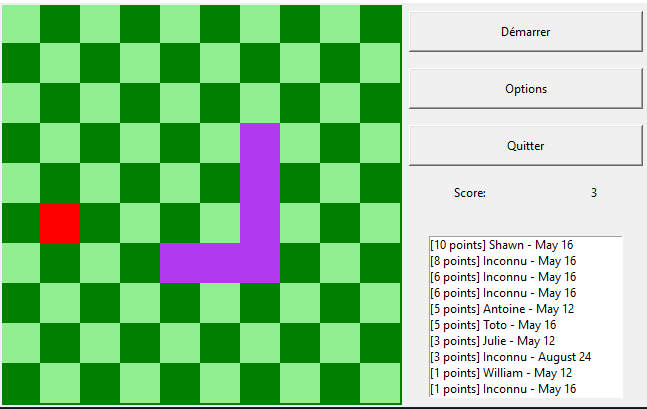
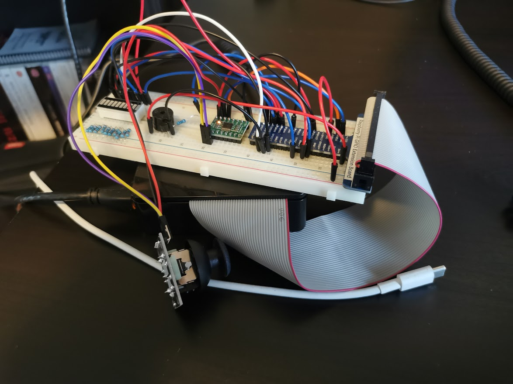

# Python Snake *(pun not intended)*

This was made for a end of semester assigned where I needed to create a piece of software that would use a raspberry pi and a user interface.
The game works physical controls but will work without them using a keyboard. The Raspberry pi docs are long gone.

*Le jeu a été fait pour un projet de fin de session où j'avais besoin d'exploiter un raspberry pi et une interface utilisateur. Le programme fonctionne avec des contrôles physiques, mais peut également fonctionner avec un clavier traditionnel.*

**Yes, the game is very choppy ;)**

  

